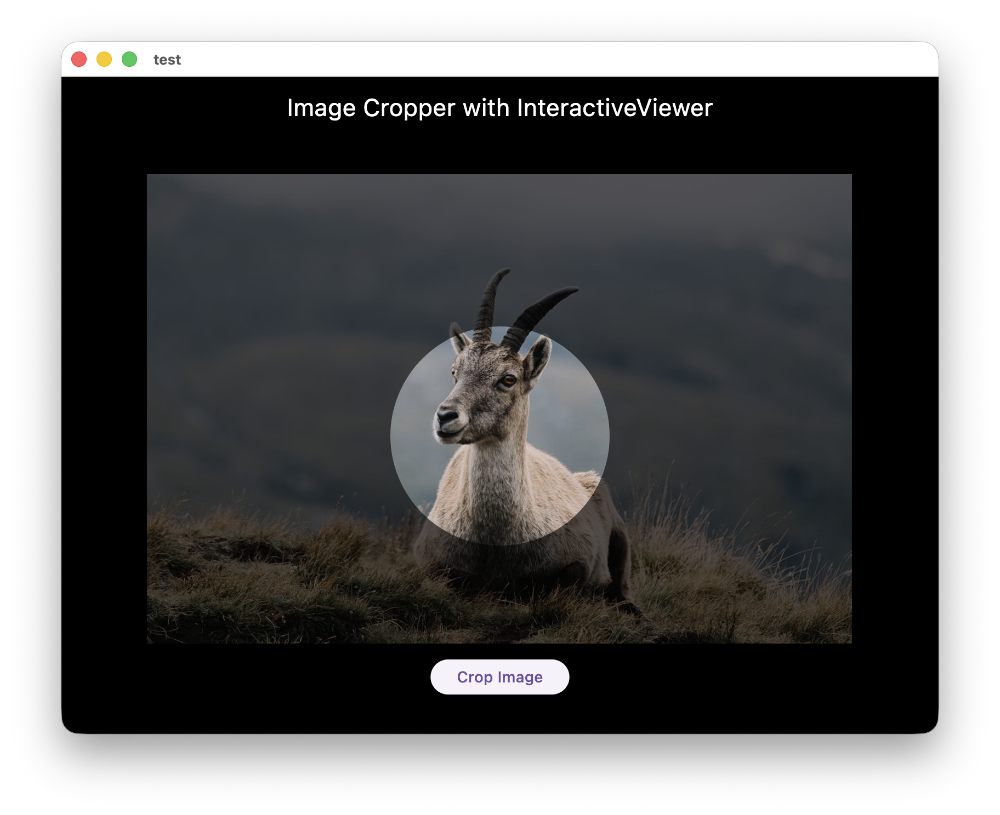
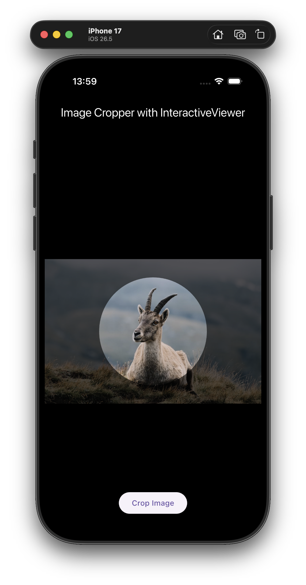
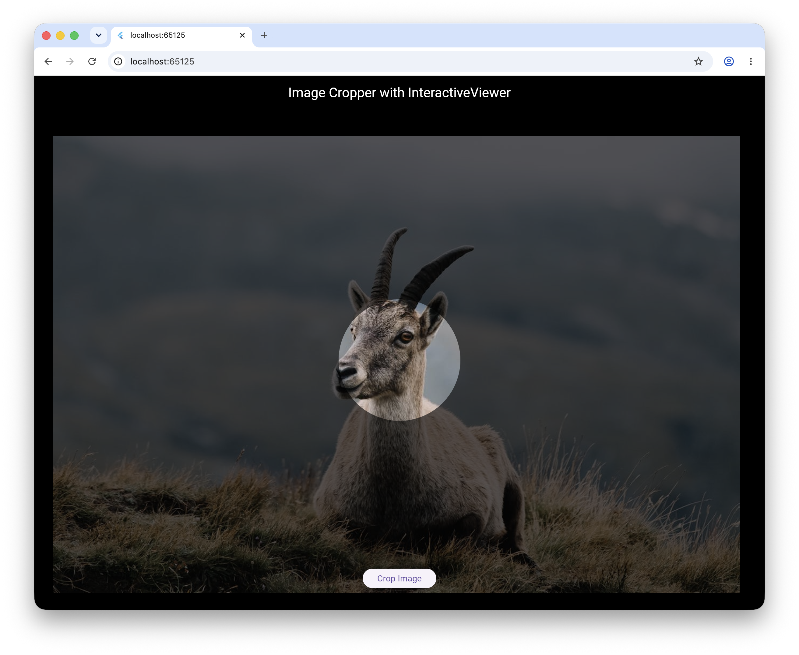

# Image Cropper with InteractiveViewer

A Flutter application demonstrating a custom image cropping tool implemented with the `InteractiveViewer` widget. This project provides a smooth, intuitive photo cropping experience inspired by **Telegram**, where the user moves and scales the image behind a fixed circular mask.

<table>
  <tr>
    <td></td>
    <td></td>
    <td></td>
  </tr>
</table>

## Features

- **Interactive Zoom & Pan**: Leverage `InteractiveViewer` for natural gestures to adjust the image position and scale.
- **Circular Crop Overlay**: A custom-painted overlay providing a clear visual guide for the cropping area.
- **True Cross-Platform Support**: Works seamlessly across **Web**, **Desktop** (macOS, Windows, Linux), and **Mobile** (iOS, Android).
- **Optimized Performance**: 
  - **Native**: Uses background Isolates via the `compute` function to keep the UI responsive.
  - **Web**: Uses optimized Canvas API and `ImageData` for high-performance image manipulation.
- **Precise Matrix Mapping**: Uses transformation matrices to accurately map the screen crop area back to the original image coordinates, regardless of the zoom level.

## How It Works

The project tracks image transformations using the `TransformationController`.

1. **Matrix Inversion**: When cropping, the inverse of the transformation matrix is applied to the crop area's screen coordinates.
2. **Coordinate Scaling**: These coordinates are scaled to match the original image's high-resolution dimensions.
3. **Conditional Workers**: 
   - On **Native** platforms, the raw bytes are processed in an Isolate using the `image` package.
   - On **Web**, the image is rendered to an offscreen Canvas using `ImageData` and `drawImage`, then exported as a Blob.
4. **Result**: The final cropped image is returned as a standard Flutter `Image` widget.

## Project Structure

- `lib/main.dart`: Entry point of the application.
- `lib/image_cropper.dart`: Main UI widget with `InteractiveViewer` and the crop overlay.
- `lib/crop_image_service.dart`: Facade service that coordinates matrix calculations and platform-specific workers.
- `lib/web_worker.dart`: Web-specific implementation using `package:web`.
- `lib/native_worker.dart`: Native implementation using Dart Isolates.
- `lib/circle_cutout_painter.dart`: Custom painter for the circular mask overlay.

## Getting Started

1. **Clone the repository.**
2. **Ensure you have Flutter installed.**
3. **Run `flutter pub get`** to install dependencies.
4. **Run the app** on your target platform (Web, Desktop, or Mobile).

## Dependencies

- [image](https://pub.dev/packages/image): For native-side image processing.
- [web](https://pub.dev/packages/web): For modern Web API interactions.
- [vector_math](https://pub.dev/packages/vector_math): For matrix transformations.
